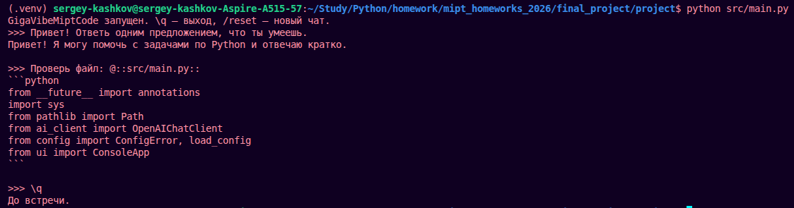

# GigaVibeMiptCode

Консольный чат с LLM через OpenAI-совместимый API. Я проверял проект с локальной Ollama, но можно указать и другой совместимый сервер.

## Структура

```text
src/
  main.py         точка входа и консольный цикл
  ai_client.py    запросы к модели
  config.py       чтение config.yaml и переменных окружения
  context_mgr.py  история сообщений и лимиты контекста
  file_mgr.py     подстановка файлов через @::path::
  commands.py     разбор /filechunk
tests/            pytest-тесты
screenshots/      скриншоты запуска
```

## Что реализовано

- обычный чат с потоковым выводом ответа;
- сохранение истории и обрезка по числу сообщений/символов;
- системный промпт из конфига;
- настройки из `config.yaml` и env-переменных;
- обработка `Ctrl+C` во время генерации и ввода;
- вставка локального текстового файла через `@::src/main.py::`;
- режим `/filechunk` для обработки файла частями;
- команды `/reset` и `\q`;
- тесты, ruff и mypy.

## Установка

```bash
cd final_project
python -m venv .venv
source .venv/bin/activate
python -m pip install -r requirements.txt
```

## Конфиг

`config.yaml` должен лежать рядом с этим README. Файл не коммитится.

```yaml
api_key: ollama
api_host: http://localhost:11434/v1/
model: gemma3:270m
limit_message: 20
limit_chars: 4000
temperature: 0.2
stream: true
system_prompt: Ты помогаешь с задачами по Python и отвечаешь кратко.
```

Env-переменные имеют приоритет: `API_KEY`, `API_HOST`, `MODEL`, `LIMIT_MESSAGE`, `LIMIT_CHARS`, `TEMPERATURE`, `STREAM`, `REQUEST_TIMEOUT`.

## Запуск

Первый раз нужно скачать модель:

```bash
ollama pull gemma3:270m
```

Если сервер Ollama не запущен, в отдельном терминале:

```bash
ollama serve
```

Запуск приложения:

```bash
python src/main.py
```

Команды в чате:

```text
\q
/reset
/filechunk paragraph=3
/filechunk len=150 -y
Проверь файл: @::src/main.py::
```

## Скриншоты




## Проверки

```bash
python -m ruff check --config ruff.toml src tests
MYPYPATH=src python -m mypy src tests
PYTHONPATH=src python -m pytest --cov=src --cov-report=term-missing --cov-report=html:coverage_html
```

HTML-отчёт покрытия лежит в `coverage_html/index.html`.

Последний локальный прогон: `ruff` и `mypy` проходят, `pytest` — 19 passed, покрытие 77%.
