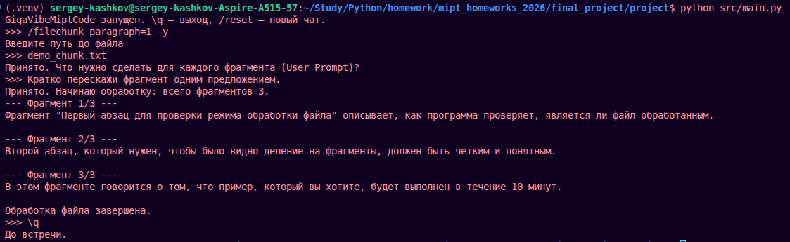

# GigaVibeMiptCode

Это консольный чат для API, совместимого с OpenAI. Я сделал его как обычное CLI-приложение: пользователь пишет сообщение в терминале, программа отправляет запрос к модели и печатает ответ.

## Структура проекта

```text
project/
  src/
    ai_client.py      # работа с OpenAI-compatible клиентом
    commands.py       # разбор /file_chunk и деление текста на части
    config.py         # чтение config.yaml и переменных окружения
    context_mgr.py    # история сообщений и обрезка контекста
    file_mgr.py       # чтение файлов для @::path::
    main.py           # запуск приложения
    ui.py             # консольный интерфейс
  tests/
    test_ai_client.py
    test_commands.py
    test_config.py
    test_context.py
    test_files.py
    test_ui.py
  screenshots/
    chat.png
    file_chunk.png
  requirements.txt
  README.md
```

Я разделил код по задачам, чтобы работа с моделью, конфигом, файлами, историей и консольным вводом не лежала в одном файле.

## Что реализовано

- обычный чат с моделью;
- хранение истории сообщений;
- ограничение контекста по числу сообщений;
- ограничение контекста по числу символов;
- загрузка настроек из `config.yaml`;
- переопределение настроек через переменные окружения;
- streaming-вывод ответа;
- обработка `Ctrl+C` во время ожидания ответа модели;
- подстановка файлов через `@::path/to/file::`;
- проверка размера файла для подстановки, лимит 5 МБ;
- команда `/file_chunk`;
- алиас `/filechunk`;
- деление файла по абзацам: `/filechunk paragraph=3`;
- деление файла по символам: `/filechunk len=150`;
- флаг `-y`, чтобы обработать все части подряд;
- команда `/reset`;
- команда `\q`;
- unit-тесты.

## Установка

```bash
python -m venv .venv
source .venv/bin/activate
python -m pip install -r requirements.txt
```

На Windows:

```powershell
python -m venv .venv
.\.venv\Scripts\Activate.ps1
python -m pip install -r requirements.txt
```

## Конфиг

Файл `config.yaml` нужно создать в папке `project`.

```yaml
api_key: ollama
api_host: http://localhost:11434/v1/
model: gemma3:270m
limit_message: 20
limit_chars: 4000
temperature: 0.2
stream: true
system_prompt: Ты помогаешь с задачами по Python и отвечаешь кратко.
```

`config.yaml` добавлен в `.gitignore`, потому что в нем может быть ключ.

Для локального запуска через Ollama я использую такой конфиг:

```bash
cat > config.yaml <<'EOF'
api_key: ollama
api_host: http://localhost:11434/v1/
model: gemma3:270m
limit_message: 20
limit_chars: 4000
temperature: 0.2
stream: true
system_prompt: Ты помогаешь с задачами по Python и отвечаешь кратко.
EOF
```

Часть настроек можно задать через переменные окружения. Они имеют приоритет над `config.yaml`.

```bash
export API_KEY=your_key_here
export API_HOST=http://localhost:11434/v1/
export MODEL=gemma3:270m
export LIMIT_CHARS=4000
python src/main.py
```

Переменные окружения:

```text
API_KEY
API_HOST
MODEL
LIMIT_MESSAGE
LIMIT_MESSAGES
LIMIT_CHARS
TEMPERATURE
STREAM
REQUEST_TIMEOUT
```

`system_prompt` читается только из `config.yaml`.

## Запуск

Для Ollama перед запуском нужно скачать модель:

```bash
ollama pull gemma3:270m
```

Если Ollama не запущена как сервис, ее можно поднять отдельной командой в другом терминале:

```bash
ollama serve
```

После этого приложение запускается так:

```bash
python src/main.py
```

Основные команды:

```text
\q
/reset
/file_chunk
/filechunk paragraph=3
/filechunk len=150 -y
```

Пример подстановки файла:

```text
Что не так с этим кодом? @::src/main.py::
```

## Скриншоты

Скриншоты сделаны из реального запуска в терминале.

Обычный чат:


Обработка файла по частям:



## Проверки

```bash
python -m ruff check --config ../ruff.toml src tests
MYPYPATH=src python -m mypy src tests
PYTHONPATH=src python -m pytest --cov=src --cov-report=term-missing
```

На последнем прогоне:

```text
ruff: all checks passed
mypy: no issues found in 13 source files
pytest: 43 passed
coverage: 80%
```

Если нужен HTML-отчет покрытия:

```bash
PYTHONPATH=src python -m pytest --cov=src --cov-report=html:coverage_html
```
